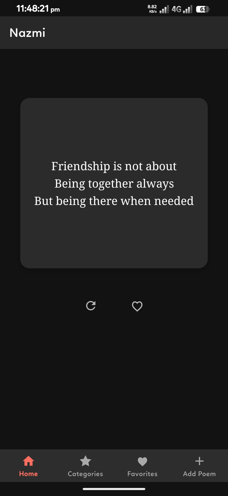
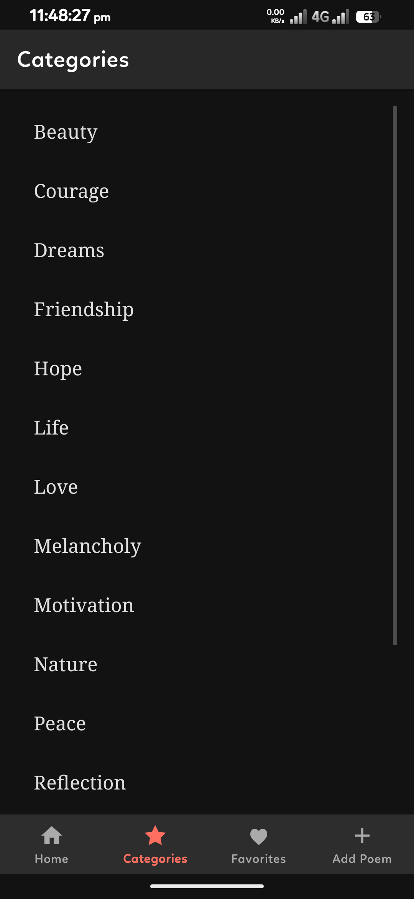
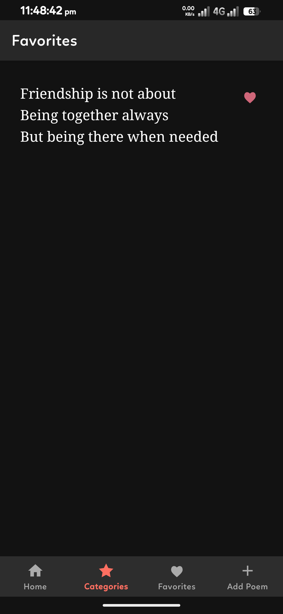
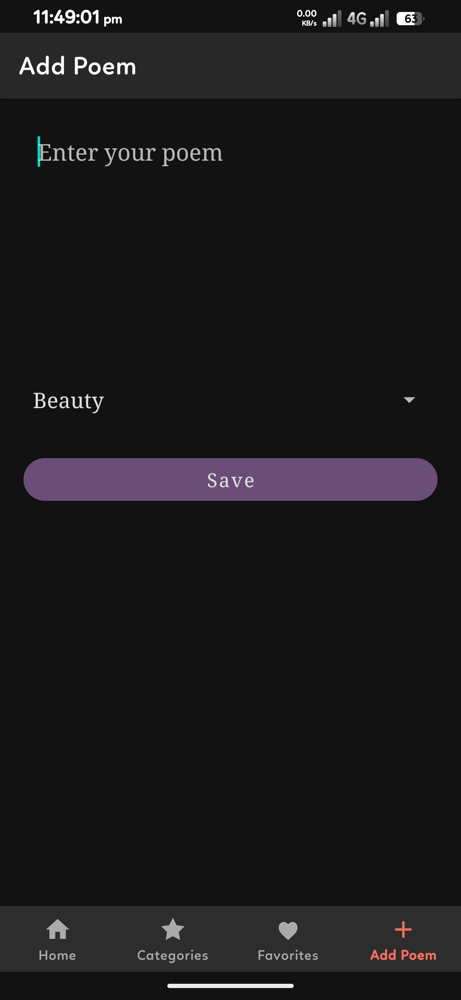
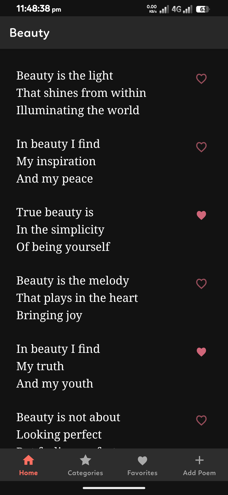

# Nazmi 🖋️

**Nazmi** is a serene digital sanctuary for poetry lovers. In a world of constant noise, Nazmi offers a quiet space to reflect on beauty, wisdom, and emotion through the timeless art of verse.

Whether you are looking for a spark of motivation to start your day, a peaceful reflection before sleep, or a place to archive your own poetic thoughts, Nazmi is designed to be your personal companion for literary discovery.

---

## 📸 Screenshots

| Home | Categories | Favorites |
| :---: | :---: | :---: |
|  |  |  |

| Add Poetry | Poem List |
| :---: | :---: |
|  |  |

---

## ✨ Features (Currently Implemented)

- **Poem of the Moment**: Discover random poems with a simple tap on the Home screen.
- **Smart Discovery**: The app ensures you don't see the same poem twice until the entire collection is shown.
- **Curated Categories**: 15+ built-in categories including Love, Nature, Life, Motivation, and Hope.
- **Favorites Collection**: Save your favorite verses by clicking the heart icon.
- **Personal Poetry**: Add your own poems and store them in the "User Added" category.
- **Manage Poetry**: Long-press on your added poems to delete them.
- **Elegant Reading**: Smooth fade transitions and serif typography designed for reading.
- **Full Dark Mode**: Native support for light and dark themes.

---

## 🛠️ Built With

- **Kotlin** & **Coroutines**
- **Architecture Components** (ViewModel, LiveData)
- **SQLite Database**
- **Material Components**

---

## 🚀 How to Run

1. Clone this repo.
2. Open in Android Studio.
3. Build and Run on any device (API 23+).

---

## 📜 License
This project is licensed under the MIT License.
